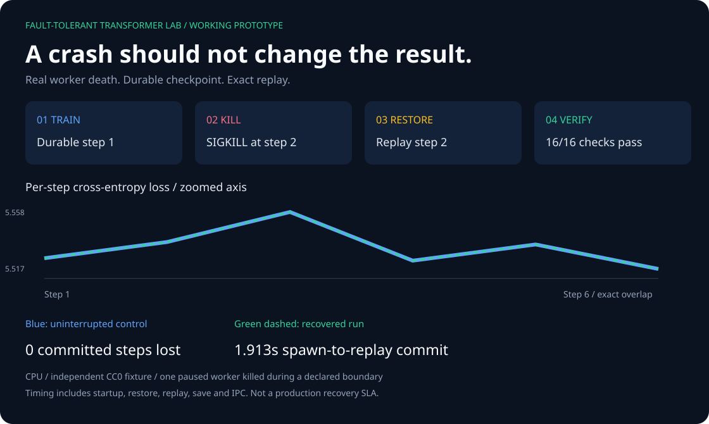

# Fault-Tolerant Transformer Lab

**Train a tiny transformer. Kill its worker. Recover without changing the result.**



This is a working CPU prototype, not a concept animation. The preview above comes from
[a recorded run](docs/demo/process-recovery-report.json) at source revision
[`9d5a901`](https://github.com/ajaykr0905/fault-tolerant-transformer-lab/commit/9d5a901797825a9e1a3cf0a426e894874f3bec9a).
The [control](docs/demo/control/result.json) and [recovered](docs/demo/recovered/result.json)
loss traces overlap exactly. All **16 equality checks passed**; **zero committed steps were lost**.
The failed, uncommitted step was replayed—not skipped.

## Run the working prototype

Start with the smallest useful test: **train → kill → restore → verify**.
The parent kills a real worker during checkpoint publication. Fresh processes load
the last committed checkpoint, replay the interrupted batch and compare the final
model, optimizer, RNG, data cursor, losses and logits with an uninterrupted control.

From this repository's root, on Linux or macOS with Python 3.12 and
[uv](https://docs.astral.sh/uv/):

```bash
uv sync --frozen --extra test
uv run --frozen fttl-demo --output artifacts/my-demo-001
```

Open `artifacts/my-demo-001/preview/index.html` in your browser. It is an offline
viewer of your **actual completed run**, with raw JSON links and all equality checks.
Training runs in Python, not in the browser. Use a new output directory each time.
After dependency installation, this demo needs no network, GPU, account or API key.

The prototype prepares six independently written CC0 fixture documents. It trains a
tiny randomly initialized transformer for six steps, sampling 12 byte windows from
two training documents—not the entire corpus. It demonstrates recovery correctness,
not language quality, arbitrary crash recovery, distributed scale or a production SLA.
The verifier deliberately pauses one worker at a known boundary before sending SIGKILL.

### Why the recovery works

Three first-principles requirements drive the design:

1. **RAM can disappear.** Recover from a durable checkpoint, not the dead worker.
2. **A step is a transaction.** Publish model, optimizer, RNG and cursor together;
   an unfinished write must never become the newest recoverable checkpoint.
3. **Recovery must be tested against a control.** Replay the same batch and compare
   the complete result—not merely whether the restarted process stayed alive.

The prototype saves step 1, kills the step-2 worker during checkpoint publication,
starts a fresh process to restore and replay step 2, then finishes step 6. Its
measured **1.913-second spawn-to-replay commit** includes process startup, imports,
restore, replay, durable save and IPC on this local CPU; it is not a latency promise.
Expand the equality checklist in the local viewer and inspect the linked raw JSON.
GitHub displays the SVG preview; the HTML viewer runs locally after cloning.

## Verified now

- A real corpus path using 656 pinned Python Enhancement Proposal documents.
- Deterministic UTF-8 byte tokenization, stable document IDs, and disjoint hash-based splits.
- Transactional training cursor and exact batch/window replay after an uncommitted step.
- Versioned checkpoint generations with atomic publication, SHA-256 integrity manifests, and
  fallback from a corrupt newest generation.
- Exact CPU equality after failures before forward, after backward, after optimizer update, and
  during checkpoint publication.
- Parent-controlled POSIX `SIGKILL` at those four boundaries, with independently spawned control,
  interrupted, replay, and completion workers and exact state comparisons.
- Original run, resume, save, and second-resume regression coverage.
- Dataset, tokenizer, configuration, code, run-contract, and final-state fingerprints.
- A bounded USGS earthquake-feed capture ledger that seals immutable snapshots for the same
  offline training/recovery pipeline.

The checked-in [recovery matrix](artifacts/peps-recovery-v0.2/matrix.json) records four failure
scenarios with two consecutive restarts each. All scenarios reached the same final state digest and
passed every declared equality check. This six-step smoke proof samples 12 windows from 12 training
documents; it does not claim to train over all 656 corpus documents. See
[the evidence ledger](docs/evidence.md) for commands, environment, provenance, and limitations.

## Five-minute local proof (network-free)

Prerequisites: Python 3.11+ and [uv](https://docs.astral.sh/uv/).

```bash
git clone https://github.com/ajaykr0905/fault-tolerant-transformer-lab.git
cd fault-tolerant-transformer-lab
uv sync --frozen --extra test
uv run pytest
uv run fttl-train-smoke \
  --config configs/smoke.json \
  --output artifacts/local-smoke
```

The tests use an independently written, public-domain fixture and do not download the PEP corpus.
Every output command requires a fresh directory so an earlier run cannot be silently overwritten.

## Reproduce the pinned PEP recovery proof

The preparation step is the only command that needs network access. It downloads one revision-pinned
gzip file into `.cache/`, verifies its compressed SHA-256 before decompression, and writes a
canonical `DatasetManifestV1`. The corpus itself and binary checkpoints stay out of Git.

```bash
uv run fttl-prepare-peps \
  --cache-dir .cache/fttl \
  --output .cache/fttl/peps-v1

uv run fttl-train-smoke \
  --config configs/peps-cpu.json \
  --dataset-manifest .cache/fttl/peps-v1/manifest.json \
  --output artifacts/local-peps

uv run fttl-verify-recovery \
  --config configs/peps-cpu.json \
  --dataset-manifest .cache/fttl/peps-v1/manifest.json \
  --failure-point after-optimizer \
  --restarts 2 \
  --output artifacts/local-peps-recovery
```

Run the complete four-scenario matrix with:

```bash
uv run fttl-recovery-matrix \
  --config configs/peps-cpu.json \
  --dataset-manifest .cache/fttl/peps-v1/manifest.json \
  --restarts 2 \
  --output artifacts/local-peps-matrix
```

## Prove recovery after an OS-process kill

On a POSIX system, the parent waits for a deterministic step-2 boundary and sends `SIGKILL`
to the training worker. A fresh process loads durable step 1, replays the failed batch,
and commits it before another fresh process completes training. The verifier compares
the result with an independently spawned uninterrupted control.

After preparing the dataset above:

```bash
uv run --frozen fttl-verify-process-recovery \
  --config configs/peps-cpu.json \
  --dataset-manifest .cache/fttl/peps-v1/manifest.json \
  --failure-point during-checkpoint-write \
  --timeout-seconds 60 \
  --output artifacts/local-peps-process-kill
```

Each worker has a bounded deadline and is reaped on success or failure. The report records
signal exit status, selected generation, failed/replayed sample IDs, exact equality, staging
cleanup, and explicitly defined timing boundaries. CI uses only the independent CC0 fixture;
this command acquires no data. See [the process-recovery operating instructions](docs/process-recovery.md)
for all four boundaries, output handling, and what a paused-boundary kill does not prove.

## Evaluate a checkpoint

For checkpoint-bound validation or test loss, use
[the held-out evaluation command](docs/evaluation.md). It includes short final windows,
counts each next-byte target once and reports the exact evaluated subset.

## Compare full tuning with LoRA on public bytes

Start from the same random tiny Transformer, replay identical training windows and CPU dropout
states, and measure each arm on validation documents before and after training:

```bash
uv run --frozen fttl-compare-public-tuning \
  --config configs/peps-cpu.json \
  --dataset-manifest .cache/fttl/peps-v1/manifest.json \
  --rank 4 --max-eval-tokens 4096 \
  --output artifacts/public-tuning-001/result.json
```

Prepare the pinned PEP manifest above first. For a network-free prototype instead, use the
`config.json` and `dataset/manifest.json` created by `fttl-demo` with `--rank 2`. The report records
paired samples, token counts, validation NLL, adapter-only parameter counts and unchanged frozen
base weights. It is a bounded CPU mechanics experiment, not pretrained-model fine-tuning or a
claim that LoRA improves language quality. See [the comparison runbook](docs/public-tuning.md),
including portable adapter state and standalone inference conversion.

## Experimental NVIDIA GPU run

For the first experimental single-NVIDIA-GPU checkpoint reconstruction, see the
[Colab GPU runbook](docs/colab-gpu.md). It requires actual CUDA allocation and records hardware and
equality checks; the existing CPU recovery evidence is not relabeled as GPU evidence.
The [first measured T4 report](artifacts/colab-cuda-2026-10-03/cuda-recovery-report.json)
passes all 11 equality checks for six FP32 steps. This is same-process reconstruction, not GPU
process-kill recovery. Use the [pinned Colab notebook](notebooks/colab_cuda_recovery.ipynb) to reproduce it.
See the [Colab notebook and evidence](docs/colab-gpu-evidence.md) for the executed notebook link,
report and access limitations; screenshot capture is not yet published.

The separate [CUDA process-death verifier](docs/cuda-process-recovery.md) checks
one actual SIGKILL boundary using independently spawned GPU workers. The
[corrected October 4 T4 export](artifacts/colab-cuda-process-2026-10-04/cuda-process-recovery-report-65d2808.json)
records all 22 equality checks passing after step-1 restore and step-2 replay.
The four-target GPU regression gate passed all 70 tests without skips at the
pinned test-isolation fix. See the runbook for the original failure, both raw
reports and the reproducible notebook. This measured run does not demonstrate
arbitrary failure recovery or production reliability.

The [uploaded executed notebook](notebooks/executed/colab_cuda_process_recovery_2026-10-05.ipynb)
is preserved unchanged as historical evidence. The [launch notebook](notebooks/colab_cuda_process_recovery.ipynb)
is a clean, tested template for a new run; preserving the export is not a new GPU-run claim.

## Research references and upstream work

This lab studies reliable training, not language-model quality. Its workload is an independently
written, randomly initialized decoder-only Transformer; the PEP configuration has 34,720 parameters.
It is not a pretrained Llama, Qwen or GPT model, and no paper's benchmark is reproduced here.

- [Attention Is All You Need](https://arxiv.org/abs/1706.03762) supplies the conceptual Transformer
  foundation. This decoder-only model is not a reproduction of the paper's encoder–decoder model.
- [LoRA: Low-Rank Adaptation of Large Language Models](https://arxiv.org/abs/2106.09685) is the
  adapter reference. Current adapters are tested on synthetic and bounded public-byte CPU workloads,
  not a fine-tuned pretrained model or evidence of improved language quality.
- [PyTorch's fault-tolerant Llama experiment](https://pytorch.org/blog/fault-tolerant-llama-training-with-2000-synthetic-failures-every-15-seconds-and-no-checkpoints-on-crusoe-l40s/)
  and [TorchFT](https://docs.pytorch.org/torchft/) motivate the reliability direction. Their
  distributed peer-recovery design and scale results are not implemented or claimed by this lab.

See [the research basis and parallel upstream contributions](docs/research-basis.md) for the
relationship between these references, this repository's own evidence and Ajay's upstream PRs.

## Live-feed capture, deterministic training

Milestone 2 captures versioned USGS event records into a SQLite WAL ledger, deduplicates by
`(source, event_id, updated_at_ms)`, and seals a content-addressed JSONL snapshot. Training consumes
the sealed snapshot, not a mutable network response.

```bash
uv run fttl-capture-usgs \
  --feed all-day \
  --database .cache/fttl/usgs.sqlite3 \
  --output .cache/fttl/usgs-v1 \
  --polls 1
```

The command prints the resulting training-manifest path. This is **real-time feed ingestion with
deterministic snapshot training and recovery**. It is not online learning and it does not predict
earthquakes. CI exercises the same path with a synthetic USGS-compatible fixture and never makes a
network request.

## Recovery transaction

```text
prepare batch -> forward/backward -> optimizer update -> commit step + cursor
      ^                                                        |
      |                    crash before commit                 |
      +--------------------------------------------------------+
```

An uncommitted attempt must reuse the same batch after restart. A v2 checkpoint becomes eligible for
recovery only after its state file and integrity manifest are durable and its generation is
atomically published. Its loader validates size, digest, schema, expected keys, model configuration,
dataset identity, tokenizer identity, and run contract before deserialization. The narrowly scoped
legacy-v1 migration is documented separately as a trusted-local path without a sidecar digest.

Read [the architecture](docs/architecture.md) and [checkpoint security boundary](docs/checkpoint-security.md)
for the exact state machine and threat model.

## Repository map

- `src/fttl/dataset.py` — pinned PEP preparation, manifest validation, and byte tokenizer.
- `src/fttl/data.py` — synthetic and prepared-data batch sources plus `TrainingCursorV1`.
- `src/fttl/train.py` — transaction boundary, controlled interruption, and run fingerprints.
- `src/fttl/checkpoint.py` — generation-based durable publication and integrity validation.
- `src/fttl/recovery.py` — repeated-restart proof and `RecoveryReportV1`.
- `src/fttl/process_recovery.py` — spawned-worker SIGKILL proof and `ProcessRecoveryReportV1`.
- `src/fttl/matrix.py` — four failure scenarios plus incompatibility/corruption checks.
- `src/fttl/usgs.py` — bounded capture, SQLite ledger, sealed snapshot, and dataset adapter.
- `artifacts/peps-recovery-v0.2/` — public-safe manifests and reports; no binary checkpoints.
- `tests/` — unit, integration, recovery, corruption, provenance, and security-boundary tests.
- `docs/research-basis.md` — upstream ideas studied, attribution, and non-copying boundary.

## Evidence boundary

The default prototype proves deterministic recovery for a small, pinned CPU run. The separate
recorded T4 experiment above covers one GPU process-death boundary. Neither proves model
quality, pretrained-model fine-tuning, simultaneous multi-worker training, distributed scale,
production readiness, or a service-level recovery objective. The original matrix uses
deterministic Python exceptions. The additional process verifier sends real `SIGKILL` to one paused
worker at a selected boundary; the OS and filesystem remain running. Arbitrary asynchronous kills,
filesystem faults, and physical power loss are not covered.

The LoRA experiments compare adapter mechanics under controlled synthetic and public-byte CPU
workloads. They are not evidence that a pretrained model improved.

Full resume checkpoints are trusted local artifacts. `torch.load(..., weights_only=True)` and
SHA-256 validation reduce risk, but a digest is not authentication if an attacker can replace both
the payload and manifest.

## Next evidence gates

1. Arbitrary asynchronous kills, filesystem fault injection, and power-loss durability evidence.
2. A pinned pretrained model with a real LoRA evaluation and retention checks.
3. Broader GPU failure-boundary coverage and larger profiled workloads beyond the recorded six-step checks.
4. Multi-process PyTorch Distributed Checkpoint or TorchFT experiments.
5. Authenticated checkpoint manifests and remote object-store publication.

## Clean-room and data statement

All implementation code and fixtures are independently written for this public lab. No employer,
customer, private, personal, or social-media data is used. External datasets are revision-pinned,
attributed, validated, and accompanied by their stated limitations.

## License

Code is MIT licensed. Dataset licenses and attribution remain governed by their respective sources.
